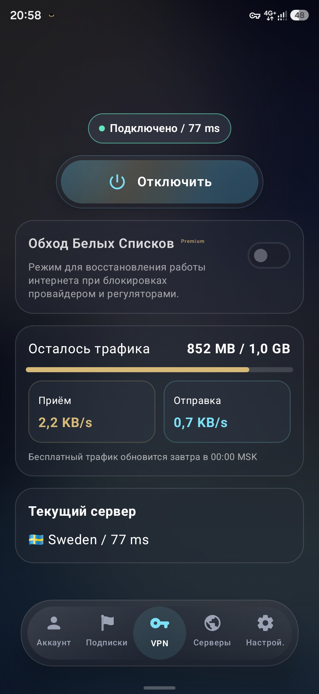
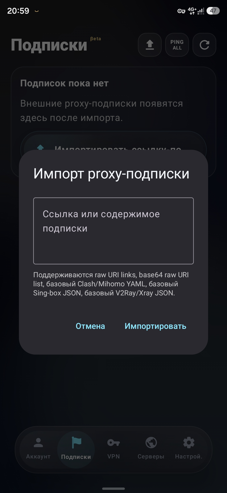
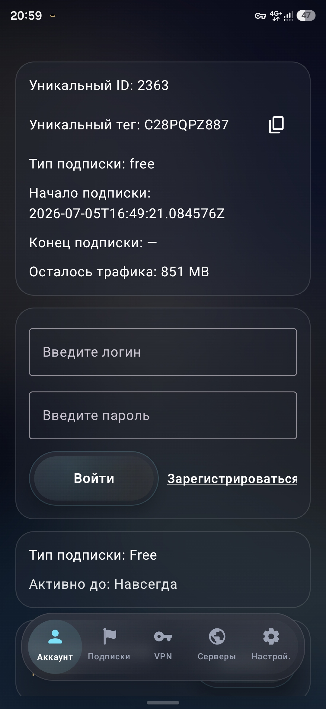
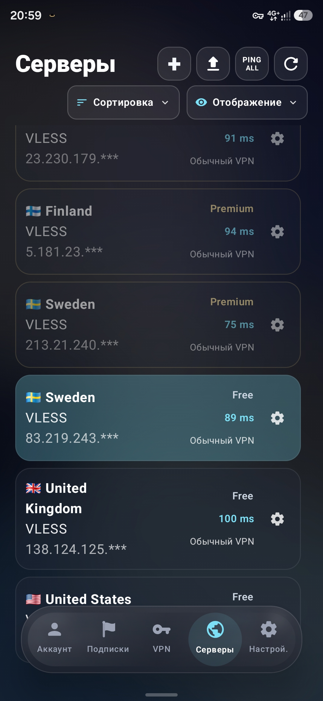
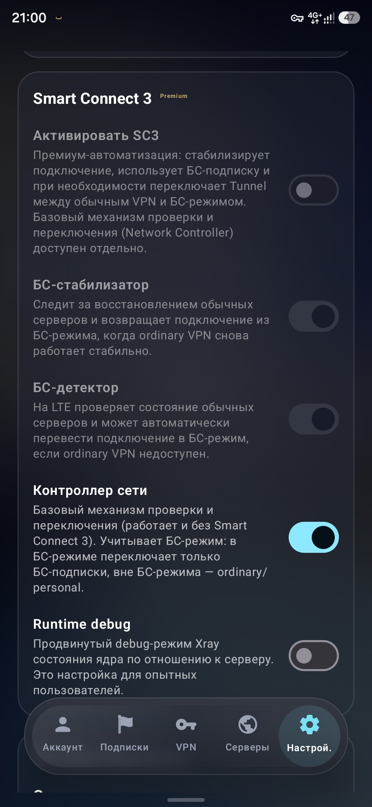
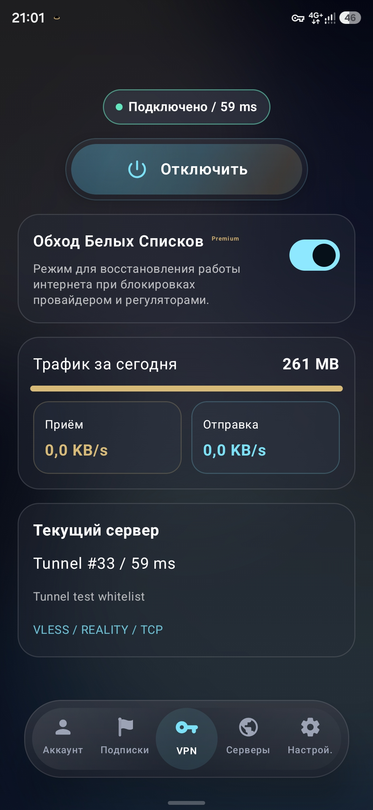
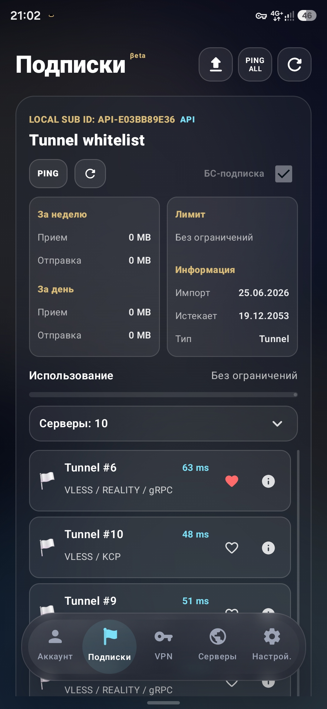

<p align="center">
  
</p>

<h1 align="center">Tunnel</h1>

<p align="center">
  <b>Не просто Xray-конфигуратор. Tunnel помогает найти рабочее подключение там, где обычные VPN часто не справляются.</b>
</p>

<p align="center">
  Xray / Mihomo / HEV · Сервера уже внутри · подписки и личные конфигурации · fallback · DPI / whitelist-oriented logic · Smart Connect 4.0<br /><br />
  <b>Протестировано в режимах Белых Списков в Московской Области, Удмуртии, Самарской Области, Волгограде, Туапсе, Ростове-на-Дону, Пскове, Владивостоке, Крыму и других регионах.</b><br />
</p>

<p align="center">
  
  
  
  
  
  
  
</p>

---

## О проекте

**Tunnel** — приложение для управления туннелированием на базе **Xray и Mihomo**, ориентированное на стабильную работу в сетях с ограничениями, DPI и whitelist-фильтрацией.

Проект объединяет автоматическую выдачу конфигураций, привязку доступа к аккаунту, серверы из подписок, Белые Списки, резервные маршруты, избранные серверы, игнорирование туннелирования для отдельных приложений и автоматическое восстановление подключения при сетевых сбоях.

Главная идея Tunnel — не просто подключить пользователя к VPN, а сохранить доступ к интернету даже в условиях агрессивной фильтрации трафика.

Мы успешно пережили массовые РКН-блокировки в августе 2026 и не собираемся останавливаться.

---

## Интерфейс приложения

<p align="center">
  
  
  
  
</p>

<p align="center">
  
  
  
</p>

---

## Почему Tunnel

Обычные VPN-клиенты часто требуют ручной настройки, плохо адаптируются к фильтрации трафика и не рассчитаны на централизованное управление доступом.

**Tunnel** решает эту проблему за счёт:

- автоматического получения и обновления конфигураций;
- привязки конфигов к аккаунту пользователя;
- поддержки личных серверов, URL-подписок и полных Clash/Mihomo-профилей;
- проверки доступности серверов;
- аварийного переключения между маршрутами;
- учёта работы серверов в условиях DPI и whitelist-фильтрации;
- Smart Connect 4, который учитывает состояние сети и сценарий запуска;
- исключения отдельных приложений из VPN/TUN;
- интерфейса, рассчитанного на ежедневное использование, а не только на ручную настройку протоколов.

---

## Почему это не обычный Xray-клиент

Большинство Xray/VLESS-клиентов работают как конфигураторы: пользователь сам ищет конфиг, вставляет ссылку, проверяет серверы и разбирается, почему подключение не работает.

Tunnel строится иначе:

| Обычные клиенты (Happ, V2rayNG, KaringX, FlClashX и т.д.) | Tunnel |
|---|---|
| Пользователь сам ищет конфиг | Готовые маршруты уже внутри приложения |
| Серверы проверяются вручную | Есть проверка доступности серверов |
| При сбое пользователь разбирается сам | Есть failover-логика: Tunnel подбирает следующий подходящий маршрут |
| Подписка обычно выглядит как список нод | Поддерживаются отдельные ноды и полные Clash/Mihomo-профили |
| Интерфейс часто технический | Упор на современный мобильный UX |
| Главный сценарий — импорт конфига | Главный сценарий — найти рабочее подключение |

---

## Возможности

- **Автоматическое получение конфигураций**  
  Приложение может получать и обновлять доступные конфиги без ручного копирования.

- **Привязка конфигураций к аккаунту**  
  Конфиги связываются с аккаунтом пользователя и управляются централизованно.

- **Аварийное переключение**  
  При проблемах с подключением приложение может попробовать перейти на другой подходящий сервер. Особенно актуально при усиленных блокировках и нестабильной мобильной сети.

- **Работа с DPI и whitelist-фильтрацией**  
  Tunnel ориентирован на сценарии, где обычное VPN-подключение может быть нестабильным из-за фильтрации трафика. Для этого используются Белые Списки, Smart Connect и отдельная логика восстановления маршрута.

- **Smart Connect 4**  
  Smart Connect помогает отличать обычное подключение, нестабильную сеть, потерю маршрута и сценарии Белых Списков. Он участвует в запуске с главного экрана, Quick Tile, виджета и AutoConnect, а также в восстановлении после смены Wi‑Fi или мобильной сети.

- **Лайт-режим производительности**  
  Для слабых устройств предусмотрен режим, уменьшающий blur-эффекты и сложные анимации без изменения логики VPN.

- **Поддержка Xray, Mihomo и популярных протоколов**  
  Tunnel работает с личными и пользовательскими конфигурациями VLESS, VMess, Shadowsocks, Trojan и Hysteria2, а также с Clash/Mihomo-подписками.

- **Полные Clash/Mihomo-профили**  
  В 0.15.0 профиль больше не сводится бездумно к упрощённому списку серверов. Tunnel сохраняет важную логику поддерживаемой конфигурации: группы, rules, providers, DNS и другие профильные разделы.

- **Централизованное управление доступом**  
  Backend может хранить конфигурации, проверять их доступность и возвращать клиенту подходящие маршруты.

- **Свобода действий и трафика для собственных конфигураций**  
  Приложение не ограничивает редактирование или объём проходящего трафика для пользователей, которые используют личные конфигурации в доступных им сценариях.

- **БС-стабилизатор**  
  Функция автоматически возвращает пользователя на обычный VPN — более быстрый, чем режим Белых Списков, — когда нормальная сеть снова становится доступной.

- **Игнорирование VPN**  
  Можно настроить список приложений, для которых трафик будет идти по обычному Wi‑Fi или LTE, а не через VPN. Это полезно для приложений, которым активный VPN мешает работать.

- **Синхронизация данных**  
  В настройках аккаунта можно включить синхронизацию личных ссылок подписок, URL-нодов и статистики использования подписок. Это удобно при переходе на новое устройство. Синхронизация выключена по умолчанию.

---

## Для поставщиков подписок

Tunnel 0.15.0 — не только клиент для готовых маршрутов. Если вы развиваете VPN-сервис, вы можете отдавать пользователям современную подписку без отдельной «версии под Tunnel»: мы понимаем популярные форматы, поддерживаем ссылки-обёртки и сохраняем профильную логику Mihomo.

### Полные профили вместо потери логики

Tunnel принимает Clash/Mihomo YAML-профили, включая сценарии с:

- `proxy-groups`;
- `proxy-providers`;
- `rules` и `rule-providers`;
- `dns`, `tun`, `sniffer`;
- `profile`, `experimental`, `hosts`, `listeners` и другие поддерживаемые разделы.

Профиль проходит проверку перед сохранением. Если он не поддерживается или не проходит валидацию, Tunnel не должен молча превращать его в неполный набор нод.

### Ссылки, которые удобно отправлять пользователю

Обычная HTTP(S)-ссылка подписки уже подходит. Для кнопки «Открыть в Tunnel» используйте:

```text
tunnel://install-config?url=https%3A%2F%2Fsub.example.com%2Fprofile%3Ftoken%3Ddemo
```

Также принимаются документированные ссылки-обёртки Clash, Mihomo, sing-box, Hiddify, Happ и совместимых клиентов. Tunnel принимает только ожидаемые безопасные варианты ссылок — это защищает пользователя от случайного импорта произвольных URI.

### Сообщение от провайдера

Вы можете передать пользователю короткое сообщение вместе с подпиской. Tunnel поддерживает Markdown и BBCode для выравнивания текста.

```markdown
## Технические работы

Новая локация уже доступна. [Открыть личный кабинет](https://example.org)

[center]Спасибо, что выбираете наш сервис[/center]
```

Поддерживаются заголовки, обычный текст, *курсив*, **жирный**, ***жирный курсив***, ссылки и выравнивание `[left]`, `[center]`, `[right]`, `[justify]`. Сообщение ограничено 1000 символами, поэтому его лучше использовать для действительно важной информации.

### Управление политикой торрент-трафика

Tunnel позволяет передать дополнительную политику через параметр `x-tunnel-torrent` в ссылке подписки:

```text
https://sub.example.com/profile?token=demo&x-tunnel-torrent=0
https://sub.example.com/profile?token=demo&x-tunnel-torrent=1
https://sub.example.com/profile?token=demo&x-tunnel-torrent=2
```

| Значение | Политика |
|---|---|
| `0` | Торрент-клиенты исключаются из VPN/TUN для этой подписки. |
| `1` | Торрент-клиенты идут через VPN только через разрешённые ноды. |
| `2` | Торрент-клиенты разрешены через VPN на любой ноде подписки. |

Для режима `1` Tunnel ищет разрешающую метку в имени ноды, `remark` или исходном `remark`, без учёта регистра:

```text
torrent
p2p
share
freenetwork
x-tunnel-torrent=1
xtt1
```

Параметр не передаётся поставщику во время загрузки самой подписки и не мешает её использованию в других клиентах.

### Совместимость протоколов

Для списков нод Tunnel понимает VLESS, VMess, Shadowsocks, Trojan и Hysteria2. Для профилей приоритетом является совместимость с полным Clash/Mihomo YAML, а не только отображение отдельных серверов.

---

## Дизайн

Tunnel создаётся не как обычный технический VPN-клиент, а как современное мобильное приложение с собственным визуальным стилем.

Интерфейс использует:

- тёмную **glassmorphism**-эстетику;
- мягкие blur-эффекты;
- неоново-голубые акценты;
- золотистые элементы;
- крупную типографику;
- плавные карточки и округлые формы;
- нижнюю навигацию в стиле современных мобильных приложений.

Визуальный образ Tunnel строится вокруг идеи космоса, туннеля и стабильного защищённого маршрута.  
Это делает приложение узнаваемым и отличает его от типичных утилитарных VPN-клиентов.

---

## Основные экраны

| Экран | Описание |
|---|---|
| Главный экран | Отображает статус подключения, ping, расход трафика, скорость загрузки и отдачи. |
| Серверы | Каталог серверов Tunnel, личных серверов, категорий, избранного и результатов проверки. |
| Подписки | URL-подписки, Clash/Mihomo-профили, личные ноды, сообщения поставщика и серверы из подписок. |
| Настройки | Язык, Smart Connect, уведомления, исключения из VPN, лайт-режим и другие настройки. |
| Аккаунт | Информация о пользователе, e-mail, тариф и добровольная синхронизация данных. |

---

## Как использовать Tunnel при whitelist-фильтрации

Tunnel рассчитан на работу в сетях с жёсткой DPI- и whitelist-фильтрацией, где обычные VPN-подключения могут быть нестабильны или полностью недоступны.

Для поиска рабочего маршрута:

1. Зайдите в приложение.
2. Нажмите переключатель **обхода Белых Списков**.
3. Подключитесь.
4. Дайте Tunnel завершить проверку и выбрать подходящий маршрут.

Если Smart Connect обнаружит, что обычная сеть снова работает стабильно, Tunnel сможет вернуться к обычному подключению.

---

## Особенности failover-логики

Tunnel может использовать аварийное переключение при проблемах с текущим сервером.

В версиях до 0.7.0 были доступны более ручные параметры:

- переход на другой подходящий сервер;
- попытка подключения к серверу с тем же SNI / CIDR;
- возможность выхода за пределы текущей страны;
- учёт ping выбранного сервера;
- пользовательская проверка работоспособности маршрута.

Начиная с 0.10.0 основная рекомендация проще:

> Включите Smart Connect — он сам выберет подходящий сценарий без сложных настроек и терминов.

Такая логика позволяет приложению не просто хранить список конфигов, а выбирать более подходящий маршрут при нестабильном соединении.

---

## Лайт-режим производительности

В приложении предусмотрен режим для бюджетных и слабых устройств.

Он уменьшает нагрузку на интерфейс за счёт отключения или упрощения тяжёлых визуальных эффектов:

- blur;
- сложных анимаций;
- тяжёлых визуальных переходов.

Это помогает сохранить плавность работы приложения даже на устройствах с ограниченными ресурсами.

---

## Совместимость

Tunnel поддерживает следующие Android ABI:

- `arm64-v8a`;
- `armeabi-v7a`;
- `x86_64`;
- `x86`.

---

## Архитектура

```text
User App
   │
   ├── Account binding
   ├── Auto config / subscription loader
   ├── Smart Connect
   ├── Lite performance mode
   ├── Server feedback
   │
   ▼
Tunnel Backend
   │
   ├── Config / subscription storage
   ├── Access control
   ├── Server status monitor
   ├── Route selection logic
   ├── Feedback processing
   │
   ▼
Xray / Mihomo / HEV Nodes
```
