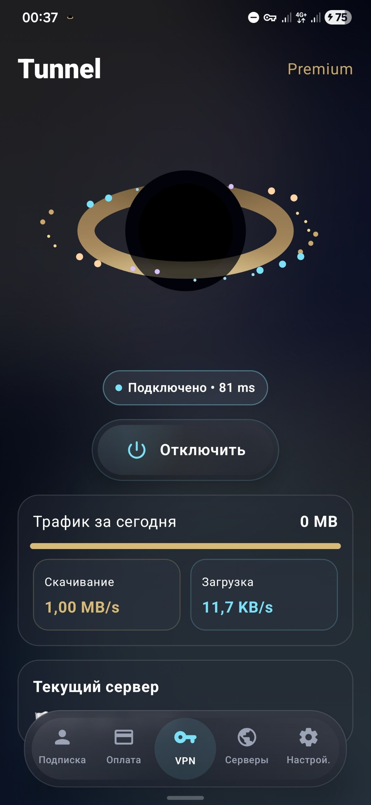
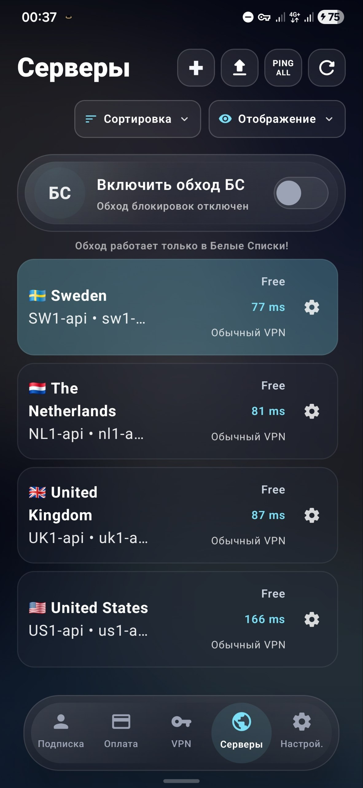
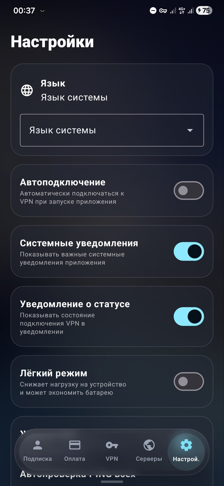
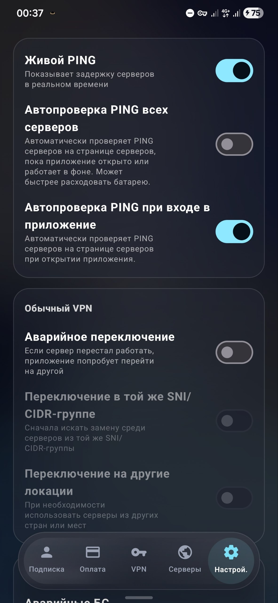
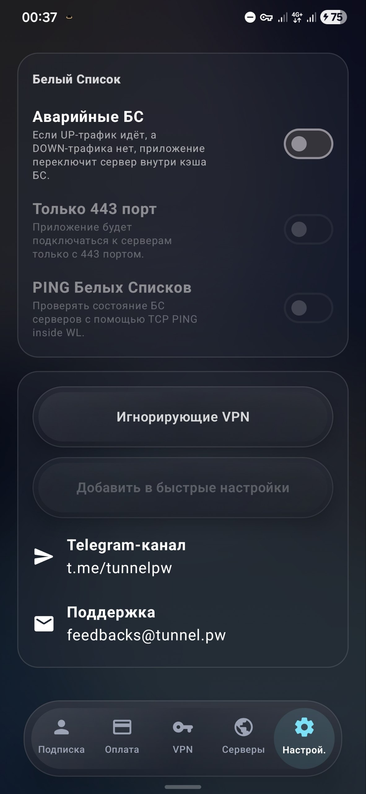

<p align="center">
  
</p>

<h1 align="center">Tunnel</h1>

<p align="center">
  <b>Не просто Xray-конфигуратор. Tunnel помогает найти рабочее подключение там, где обычные VPN часто не справляются.</b>
</p>

<p align="center">
  Xray/VLESS · готовые маршруты · проверка серверов · failover · DPI / whitelist-oriented logic<br /><br />
  <b>Протестировано в режимах Белых Списков в Московской Области, Удмуртии (крайне агрессивные DPI, БС), Самарской Области, Волгограде, Туапсе, Ростов-на-Дону, Псков, Владивосток и в Крыму.</b>
</p>

<p align="center">
  
  
  
  
  
  
</p>

---

## Навигация

- [О проекте](#о-проекте)
- [Интерфейс приложения](#интерфейс-приложения)
- [Почему Tunnel](#почему-tunnel)
- [Почему это не обычный Xray-клиент](#почему-это-не-обычный-xray-клиент)
- [Возможности](#возможности)
- [Дизайн](#дизайн)
- [Основные экраны](#основные-экраны)
- [Как использовать Tunnel при whitelist-фильтрации](#как-использовать-tunnel-при-whitelist-фильтрации)
- [Особенности failover-логики](#особенности-failover-логики)
- [Лайт-режим производительности](#лайт-режим-производительности)
- [Пользовательские проверки серверов](#пользовательские-проверки-серверов)
- [Совместимость](#совместимость)
- [Архитектура](#архитектура)

---

## О проекте

**Tunnel** — это приложение для управления туннелированием на базе **Xray**, ориентированное на стабильную работу в сетях с ограничениями, DPI и whitelist-фильтрацией.

Проект объединяет автоматическую выдачу конфигураций, привязку доступа к аккаунту, резервные маршруты, пользовательские проверки серверов и аварийное переключение при проблемах с подключением.

Главная идея Tunnel — не просто подключить пользователя к VPN, а сохранить доступ к интернету даже в условиях агрессивной фильтрации трафика.

Текущая версия Tunnel-0.7.1. Результатом обновления стало повышение отклика при Белых Списках до 99.9%. 

---

## Интерфейс приложения

<p align="center">
  
  
  
</p>

<p align="center">
  
  
</p>

---

## Почему Tunnel

Обычные VPN-клиенты часто требуют ручной настройки, плохо адаптируются к фильтрации трафика и не рассчитаны на централизованное управление доступом.

**Tunnel** решает эту проблему за счёт:

- автоматического получения и обновления конфигураций;
- привязки конфигов к аккаунту пользователя;
- проверки доступности серверов;
- аварийного переключения между маршрутами;
- учёта работы серверов в условиях DPI и whitelist-фильтрации;

---

## Почему это не обычный Xray-клиент

Большинство Xray/VLESS-клиентов работают как конфигураторы: пользователь сам ищет конфиг, вставляет ссылку, проверяет серверы и разбирается, почему подключение не работает.

Tunnel строится иначе:

| Обычные Xray-клиенты | Tunnel |
|---|---|
| Пользователь сам ищет конфиг | Готовые маршруты могут быть внутри приложения |
| Серверы проверяются вручную | Есть проверка доступности серверов |
| При сбое пользователь разбирается сам | Есть failover-логика |
| Интерфейс часто технический | Упор на современный мобильный UX |
| Главный сценарий — импорт конфига | Главный сценарий — найти рабочее подключение |

---

## Возможности

- **Автоматическое получение конфигураций**  
  Приложение может получать и обновлять доступные конфиги без ручного копирования.

- **Привязка конфигураций к аккаунту**  
  Конфиги связываются с аккаунтом пользователя и управляются централизованно.

- **Аварийное переключение**  
  При проблемах с подключением приложение может попробовать перейти на другой подходящий сервер. Особенно актуально при усиленных блокировках.

- **Работа с DPI и whitelist-фильтрацией**  
  Tunnel ориентирован на сценарии, где обычное VPN-подключение может быть нестабильным из-за фильтрации трафика. Протестировано в режимах в Белых Списков многих регионов.
  
- **Лайт-режим производительности**  
  Для слабых устройств предусмотрен режим, уменьшающий blur-эффекты и сложные анимации.

- **Поддержка Xray-инфраструктуры**  
  Возможна работа с личными и пользовательскими конфигурациями, включая наборы конфигов на базе VLESS / Xray. В будущем расширим поддержку до trojan, VMESS и прочих. 

- **Централизованное управление доступом**  
  Backend может хранить конфигурации, проверять их доступность и возвращать клиенту подходящие маршруты.
  
- **Свобода действий и трафика в приложении для собственных конфигураций VLESS**  
  Приложение не ограничивает редактирование или объем проходящего трафика для тех пользователей, которые используют личные VLESS конфигурации.

- **БС-protect**  
  Данная функция приложения автоматически переключит вас на обычный VPN (более скоростной, чем режим БС) при восстановлении работы нормальной сети (отбой опасности БПЛА)

- **Игнорирование VPN**  
  Позволяет вам настроить список приложений, для которых туннелирование не будет работать через VPN. То есть по нему будет идти обычный трафик (WiFi или LTE), рекомендуется для Max, Ozon, Банков, Яндекс-приложений.

---

## Дизайн

Tunnel создаётся не как обычный технический VPN-клиент, а как современное мобильное приложение с собственным визуальным стилем.

Интерфейс использует:

- тёмную **glassmorphism**-эстетику;
- мягкие blur-эффекты;
- неоново-голубые акценты;
- золотистые элементы;
- крупную типографику;
- плавные карточки и округлые формы;
- нижнюю навигацию в стиле современных мобильных приложений.

Визуальный образ Tunnel строится вокруг идеи космоса, туннеля и стабильного защищённого маршрута.  
Это делает приложение узнаваемым и отличает его от типичных утилитарных VPN-клиентов.

---

## Основные экраны

| Экран | Описание |
|---|---|
| Главный экран | Отображает статус подключения, ping, расход трафика, скорость загрузки и отдачи |
| Проверка сервера | Позволяет пользователю сообщить, работает ли интернет через сервер при включённых белых списках |
| Список серверов | Показывает доступные серверы, ping, статус тестирования и параметры конфигураций |
| Настройки языка | Позволяет выбрать системный язык, русский, английский, узбекский или таджикский |
| Настройки подключения | Содержит ping сервера, аварийное переключение, SNI / CIDR-логику и лайт-режим производительности |

---

## Как использовать Tunnel при whitelist-фильтрации

Tunnel рассчитан на работу в сетях с жёсткой DPI- и whitelist-фильтрацией, где обычные VPN-подключения могут быть нестабильны или полностью недоступны.

Для поиска рабочих серверов:

1. Зайдите в приложение.
2. Откройте вкладку **Сервера**.
3. Выберите режим БС* (Белые Списки) или обычный VPN.
4. Подключитесь.

*Для стабильной работы режима БС предварительно прогрузите его в рабочей сети через включение чекбокса БС.

---

## Особенности failover-логики

Tunnel может использовать аварийное переключение при проблемах с текущим сервером.

В настройках предусмотрены параметры:

- переход на другой подходящий сервер;
- попытка подключения к серверу с тем же SNI / CIDR;
- возможность выхода за пределы текущей страны;
- учёт ping выбранного сервера;
- пользовательская проверка работоспособности маршрута.

Такая логика позволяет приложению не просто хранить список конфигов, а выбирать более подходящий маршрут при нестабильном соединении.

---

## Лайт-режим производительности

В приложении предусмотрен режим для бюджетных и слабых устройств.

Он уменьшает нагрузку на интерфейс за счёт отключения или упрощения тяжёлых визуальных эффектов:

- blur;
- сложных анимаций;
- тяжёлых визуальных переходов.

Это помогает сохранить плавность работы приложения даже на устройствах с ограниченными ресурсами.

---

## Пользовательские проверки серверов

Tunnel может собирать обратную связь от пользователей о работе конкретных серверов.

Например, приложение может спросить:

> Работает ли интернет от этого сервера при включённых белых списках?

Ответы пользователей помогают понять, какие серверы реально работают в условиях фильтрации, а какие требуют замены, дополнительной проверки или исключения из автоматического выбора.

Это особенно важно для сетей, где доступность сервера может зависеть не только от ping, но и от DPI, SNI, CIDR и текущих ограничений провайдера.

---

## Совместимость

Tunnel поддерживает следующие Android ABI:

- `arm64-v8a`
- `armeabi-v7a`
- `x86_64`
- `x86`

---

## Архитектура

```text
User App
   │
   ├── Account binding
   ├── Auto config loader
   ├── Failover manager
   ├── Lite performance mode
   ├── Server feedback
   │
   ▼
Tunnel Backend
   │
   ├── Config storage
   ├── Access control
   ├── Server status monitor
   ├── Route selection logic
   ├── Feedback processing
   │
   ▼
Xray Nodes
